# Mastercard Innovation Challenge — Agentic Payment Fraud Defense

**Status (2026-08-20): all 12 tasks of `plan.md`'s build order are done** —
the full three-pillar system (Identify/Generate/Defend), the closed-loop
Mutator, the web dashboard, and the integration contract + latency
measurement, all with real measured results. Full task-by-task history,
every bug found and fixed, and the Decision Log (why the primary Defend
signal pivoted mid-project) live in [`task.md`](task.md) — this file is
a snapshot + reference, not the detailed log.

Two attack types are covered, per `TEAM_BRIEF.md` Part 10:
1. **Pre-signature Intent Artifact corruption** — indirect prompt injection
   hijacks an AI shopping agent's context *before* it signs a payment
   mandate, producing a cryptographically valid but intent-corrupted
   transaction.
2. **Transaction laundering via a fraudulent merchant network** — funds
   from a hijacked purchase flow into a shell-merchant ring sharing an
   acquirer/beneficiary.

---

## 1. Architecture

```mermaid
flowchart LR
    subgraph ID["IDENTIFY"]
        corpus["identify/corpus/*.txt\n(9 real threat reports)"]
        rag["LangGraph RAG loop\ndiscover.py"]
        taxonomy["taxonomy.json\n(77 attack entries)"]
        corpus --> rag --> taxonomy
    end

    subgraph GEN["GENERATE"]
        narrative["narrative_generator.py\nLLM-generated sessions"]
        join["join_ieee_cis.py\n+ real IEEE-CIS rows"]
        merchnet["merchant_network.py\nshell-merchant graph"]
        narrative --> join
    end

    subgraph DEF["DEFEND (5 layers)"]
        rules["1. rules.py\nhard mandate checks"]
        lgbm["2. lightgbm_baseline.py\nTHE HARD FLOOR"]
        content["3. content_layer.py\ninjection phrasing"]
        gnn["4. gnn.py\nmerchant ring GraphSAGE"]
        verdict["5. llm_verdict.py\nplain-English fusion"]
    end

    subgraph OUT["CONSUMERS"]
        dash["dashboard/\nFastAPI web UI"]
        contract["integration_contract.py\nsession-risk JSON payload"]
    end

    taxonomy -->|attack patterns| narrative
    join --> rules --> lgbm --> content --> gnn --> verdict
    merchnet --> gnn
    verdict --> dash
    lgbm --> contract
    gnn --> contract

    subgraph MUT["MUTATOR (closed loop)"]
        mutate["mutate.py\nhardens Defend's misses"]
    end
    lgbm -->|false negatives| mutate
    mutate -->|harder sessions| join
    mutate -->|candidate attacks| taxonomy
```



**Where this runs, per `TEAM_BRIEF.md` §3.3**: at the agent-provider/PSP
layer, not the Mastercard network layer — `constraint_drift` and
`utterance_artifact_divergence` need the raw human utterance, which the
network never sees. The session-risk score computed here rides along
with the signed Intent Artifact; Mastercard's Decision Intelligence
consumes it, it doesn't compute it. See [`INTEGRATION_CONTRACT.md`](INTEGRATION_CONTRACT.md)
for the exact JSON payload and measured latency.

**Primary Defend signal** (confirmed, not the originally-planned one —
see the Decision Log in `task.md`): `constraint_drift` +
`ingestion_source_trust_score` (mandate-scope/provenance checks), not
`utterance_artifact_divergence` (semantic similarity), which fails on
subtle same-domain hijacks (AUC 0.419, barely above chance) even though
it catches obvious ones perfectly (AUC 1.000). Divergence is kept as a
secondary signal.

---

## 2. Folder structure

```
generate/           Agent-session schema + synthetic data generation
  session_schema.py       AgentSession/MandateScope dataclasses — LOCKED, don't change field names/types
  synthetic_sessions.py   10 hand-written legit/hijacked examples (early prototype, superseded by narrative_generator.py)
  narrative_generator.py  Real LLM-generated sessions (benign / obvious-hijack / subtle-hijack)
  generated_sessions.py   Orchestrates generation across all domains, caches to data/generated_sessions.json
  join_ieee_cis.py        Joins generated AgentSessions onto real, sampled IEEE-CIS transaction rows
  merchant_network.py     Synthetic shell-merchant graph for attack #2 (real domain names, fabricated network)
  llm_adapter.py          LLMAdapter interface + Gemini/Groq/Ollama implementations (the only place a provider is named)

defend/             5-layer detection stack
  divergence.py            utterance_artifact_divergence (secondary signal — semantic distance utterance vs. signed artifact)
  isolation_test.py         Day-2 kill-criterion gate, hand-written set
  isolation_test_generated.py  Same gate, real LLM-generated set, obvious/subtle AUC split
  constraint_drift.py      constraint_drift + ingestion_source_trust_score — PRIMARY signal (mandate-scope/provenance checks)
  rules.py                 Layer 1 — hard mandate-scope checks, no ML
  lightgbm_baseline.py     Layer 2 — feature engineering + one full-data fit (importance only)
  evaluation.py            Layer 2's real held-out metric: stratified 5-fold CV — THE HARD FLOOR gate
  content_layer.py         Layer 3 — injection-phrasing similarity (Jaccard, reused prior-work pattern)
  content_layer_eval.py    Layer 3's precision/recall/F1 + confidence calibration (Brier/ECE)
  gnn.py                   Layer 4 — GraphSAGE over merchant/acquirer/beneficiary graph (attack #2)
  llm_verdict.py           Layer 5 — fuses layers 1-4 into a plain-English verdict for a risk analyst
  integration_contract.py  Task 12 — session-risk JSON payload for a Decision Intelligence-style consumer + real latency measurement

identify/           RAG taxonomy agent (LangGraph + Qdrant + networkx)
  corpus/*.txt             9 real, individually-fetched threat-intelligence documents
  ingestion/loader.py       Loads corpus text + a sample of Task 2's injection payloads
  ingestion/chunker.py      RecursiveCharacterTextSplitter wrapper
  ingestion/embedder.py     all-MiniLM-L6-v2 wrapper (same model as defend/divergence.py)
  vectorstore/qdrant_store.py  Local/on-disk Qdrant wrapper
  knowledge_graph.py        In-memory networkx graph of discovered attacks, hybridized with embeddings
  novelty_score.py          Dedupes new candidates vs. existing taxonomy (embedding + graph overlap)
  graph/{state,nodes,workflow}.py  The actual LangGraph cyclic loop (extract -> score/merge -> loop or end)
  discover.py               Entry point: runs the loop end-to-end -> taxonomy.json
  schema.py                 AttackVector dataclass
  taxonomy.json             Output: 77 discovered/candidate attack entries
  knowledge_graph.json      Output: raw discovery-trace graph (207 nodes, 281 edges)

mutator/            Closed-loop hardening (Task 10)
  mutate.py                 Finds Defend's hard/missed cases, generates harder variants, feeds Generate + Identify

dashboard/          Web prototype (Task 11) — FastAPI + plain HTML/CSS/JS, no build step
  main.py                   Routes + startup precompute
  data_access.py            Wires every Defend layer's real output into the UI (no new detection logic)
  static/{index.html,app.js,style.css}   Sessions / Session Detail / Metrics views

tests/              pytest, one file per module, real-pipeline tests where practical (not all mocked)
data/               Generated + downloaded datasets (gitignored — see Setup below)
plan.md             Engineering task list, in build order — the *what to build, how to know it's done*
TEAM_BRIEF.md       Positioning, demo script, judge Q&A, kill-criteria thresholds — the *why*
task.md             Running log: what was actually done, real measured results, every bug found/fixed
INTEGRATION_CONTRACT.md   Task 12's JSON schema + real example payloads + measured latency
CLAUDE.md           Instructions for Claude Code sessions working in this repo
requirements.txt    Pinned to what's actually installed and tested (see Setup below)
mastercard_fraud_defense/   Frozen snapshot of an earlier milestone — not a working directory, don't edit
```

---

## 3. Setup

### 3.1 Install dependencies

```bash
pip install -r requirements.txt
```

Confirm the semantic embedding model actually loads before trusting any
AUC number that depends on it (first run downloads ~90MB from
huggingface.co):

```bash
python3 -c "from sentence_transformers import SentenceTransformer; SentenceTransformer('all-MiniLM-L6-v2'); print('OK')"
```

### 3.2 LLM provider (pick one)

`generate/llm_adapter.py` checks these in order and uses the first one
set — put whichever you have in a repo-root `.env` file (gitignored):

| Priority | Env var | Provider |
|---|---|---|
| 1 | `USE_OLLAMA=1` | Local Ollama, no API key, no cost, no rate limit |
| 2 | `GROQ_API_KEY=...` | Groq (`openai/gpt-oss-20b`) |
| 3 | `GOOGLE_API_KEY=...` | Gemini (`gemini-2.5-flash-lite`) |

If using Ollama, install it separately and pull the model this project
was tested against:

```bash
ollama pull qwen2.5:3b-instruct
```

(A ~3B model was picked deliberately to run on a 6GB-VRAM GPU — see
`task.md` for why larger local models weren't used.)

### 3.3 IEEE-CIS dataset (needed for Tasks 4+ — Defend's LightGBM/GNN layers, the dashboard, Task 12)

This is the real-transaction fidelity baseline — **do not substitute a
different dataset** (PaySim/UPI was explicitly rejected earlier for rail
mismatch, per `TEAM_BRIEF.md` §4.7).

1. Create a Kaggle account and join the [IEEE-CIS Fraud Detection
   competition](https://www.kaggle.com/c/ieee-fraud-detection) — you
   must accept the competition rules on kaggle.com itself before the API
   will let you download anything (a plain API token isn't enough; this
   is a real gotcha hit during this project — a 403 that looked like an
   auth problem was actually this).
2. Generate an API token from your Kaggle account settings and save it:
   ```bash
   mkdir -p ~/.kaggle
   echo YOUR_KAGGLE_TOKEN > ~/.kaggle/access_token
   chmod 600 ~/.kaggle/access_token
   ```
3. Install the Kaggle CLI and download the competition data into
   `data/ieee-fraud-detection/`:
   ```bash
   pip install kaggle
   kaggle competitions download -c ieee-fraud-detection -p data/ieee-fraud-detection/
   cd data/ieee-fraud-detection && unzip ieee-fraud-detection.zip && cd ../..
   ```
   Only `train_transaction.csv` and `train_identity.csv` are actually
   used (`generate/join_ieee_cis.py` samples only `isFraud == 0` rows);
   the test/sample-submission files download alongside but aren't read.

### 3.4 What's gitignored (and why)

`.env` (API keys), `data/` (the IEEE-CIS dataset plus all generated
caches — ~1.4GB, shouldn't be redistributed and doesn't need to be,
since every generation step above reproduces it), `identify/qdrant_data/`
(local vector store), Python cache dirs.

---

## 4. Commands

Run in this order for a full pipeline rebuild (each step caches its
output, so re-running is cheap unless you delete the cache):

```bash
# Generate: 210 sessions (70 benign / 70 obvious-hijack / 70 subtle-hijack), then join to real IEEE-CIS
python3 -m generate.generated_sessions
python3 -m generate.join_ieee_cis
python3 -m generate.merchant_network

# Defend: run each layer + its evaluation
python3 -m defend.isolation_test_generated   # divergence signal, obvious/subtle AUC split
python3 -m defend.rules
python3 -m defend.evaluation                  # THE HARD FLOOR — stratified 5-fold CV
python3 -m defend.content_layer_eval
python3 -m defend.gnn
python3 -m defend.llm_verdict                 # calls the live LLM adapter

# Identify: RAG taxonomy discovery loop (LangGraph, ~15-20 min via local Ollama)
python3 -m identify.discover

# Mutator: closed-loop hardening (feeds Generate + Identify)
python3 -m mutator.mutate

# Task 12: session-risk payload + real measured latency
python3 -m defend.integration_contract

# Tests
python3 -m pytest tests/ -v

# Web dashboard
python3 -m uvicorn dashboard.main:app --host 127.0.0.1 --port 8000
# then open http://127.0.0.1:8000
```

`defend/isolation_test.py` (the hand-written-set version, not the
`_generated` one above) is the very first Day-2 gate and doesn't need
any of the above set up — it's a good smoke test right after installing
dependencies:

```bash
python3 defend/isolation_test.py
```

---

## 5. Not built — not gaps, both were solved a different, better way

Neither of these is missing work. Each was planned as one specific
approach, and that approach turned out to be unnecessary once a better
one was in place — so the file was never written, on purpose.

- **`generate/ctgan_pipeline.py`** — early planning (`TEAM_BRIEF.md`)
  sketched a CTGAN transaction generator to synthesize fake
  transaction-level data conditioned on attack label. `plan.md` (written
  after, authoritative on implementation) never actually included this
  task — Task 4 joins onto **real, sampled IEEE-CIS rows** instead of
  GAN-synthesizing fake ones. **This is the better approach, not a
  shortcut**: it avoids fabricating financial transaction data entirely
  (a real dataset needs no fidelity-validation story a GAN's output
  would) and only fabricates what's genuinely novel and has no real-world
  counterpart to sample from — the agent-session layer. Superseded
  before this project's build started, not abandoned mid-way.
- **`defend/shap_fallback.py`** — the named fallback for Task 9, to use
  *only if* the LLM verdict layer didn't come together cleanly. It
  wasn't needed because the better outcome happened instead:
  `defend/llm_verdict.py` shipped, ran against a real sample, and passed
  its consistency-check bar (see `task.md`) — so the fallback path was
  never triggered, not skipped.

---

## 6. Research references

Academic papers cited as grounding for the two attack types
(`TEAM_BRIEF.md` §1.3, Part 10 taxonomy entries #47–48):

| Paper | Link | Used for |
|---|---|---|
| Greshake et al., "Not what you've signed up for: Compromising Real-World LLM-Integrated Applications with Indirect Prompt Injection" (2023) | https://arxiv.org/abs/2302.12173 | Foundational precedent — names indirect prompt injection as an attack class; our pre-signature corruption (attack #1) is this exact mechanism applied to the moment before a payment mandate is signed |
| Debi, Zhu, Sen Gupta, "Whispers of Wealth: A Systematic Red-Teaming Study of the Agent Payments Protocol (AP2)" (May 2026) | https://arxiv.org/abs/2601.22569 | AP2-specific validation of the pre-signature injection threat model — they red-team it, we build detection + a closed loop on top |
| "Transaction Fraud Detection via an Adaptive Graph Neural Network" (2023) | https://arxiv.org/abs/2307.05633 | Academic precedent for GNN-based fraud-ring detection over transaction networks — grounds attack #2's `defend/gnn.py` approach |

Industry threat-intelligence reports — these are also the real, fetched
source documents in [`identify/corpus/`](identify/corpus/) that the
Identify RAG agent (`identify/discover.py`) actually ingests and extracts
attack entries from, not just cited in prose:

| Source | Link |
|---|---|
| Cloud Security Alliance — Secure Use of the Agent Payments Protocol (AP2) | https://cloudsecurityalliance.org/blog/2025/10/06/secure-use-of-the-agent-payments-protocol-ap2-a-framework-for-trustworthy-ai-driven-transactions |
| Halborn — AP2 Mandates Under Attack | https://www.halborn.com/blog/post/ap2-mandates-under-attack-preventing-agent-payment-fraud |
| Halborn — The Future of Agentic Payments: Security Risks and the Control Layer | https://www.halborn.com/blog/post/the-future-of-agentic-payments-security-risks-and-the-control-layer |
| Ravelin — Ecommerce Fraud Trends 2026 (survey of 1,504 fraud professionals) | https://www.ravelin.com/blog/ravelin-fraud-survey-2026-press-release |
| Darwinium — Agentic Commerce Fraud Report 2026 (survey of 500 fraud/risk/security leaders) | https://www.darwinium.com/navigating-agentic-commerce-2026-report |
| Visa — Spring 2026 Biannual Threats Report | https://usa.visa.com/about-visa/newsroom/press-releases.releaseId.22466.html |
| Zscaler ThreatLabz — Indirect Prompt Injection in Web Content Targets AI Agents | https://www.zscaler.com/blogs/security-research/indirect-prompt-injection-web-content-targets-ai-agents |

---

For the full task-by-task build history, every real bug found and
fixed, and the Decision Log explaining the primary-signal pivot, see
[`task.md`](task.md). For positioning, the demo script, and judge Q&A,
see [`TEAM_BRIEF.md`](TEAM_BRIEF.md). For the engineering task list this
was built against, see [`plan.md`](plan.md).
